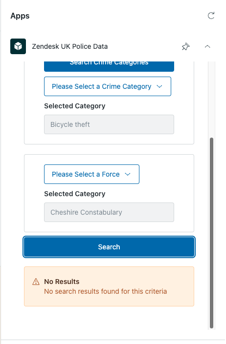

# The Zendesk UK Police Data app

Zendesk is a complete customer service solution that’s easy to use and scales with your
business. One of its core features is to manage a ticketing system, where Customer Service
agents can manage and respond to inquiries that come in. For more information on Zendesk,
see this link here: https://www.zendesk.com/what-is-zendesk/

Zendesk allows programmatic customizations that can be built on top of the platform to
extend our agent's interface in a number of ways: https://developer.zendesk.com/documentation/apps/

"Sidebar Apps" are a common choice of customization, which support a number of front-end frameworks, including the popular React JS: https://developer.zendesk.com/documentation/apps/app-developer-guide/about-the-zendesk-react-app-scaffold/

This project aims to use components from the Zendesk React Library (React Garden): https://garden.zendesk.com/
to build an Sidebar Support App to make callouts to an external API system (the UK police)
data service to query and render results.

## External API Details

The details of the UK Police service are here:

### Link to High Level API Information:

https://data.police.uk/

### API Endpoints Used

1. Crime Categories - https://data.police.uk/docs/method/crime-categories/
1. List of Forces - https://data.police.uk/docs/method/forces/
1. Crimes with no location - https://data.police.uk/docs/method/crimes-no-location/

Based on the crime category and force the user selects, we perform a query to view
data based on the two parameters.

**For best results, select a date between the years of 2022 and 2023**

## Screenshots of the App

1. Overview of Zendesk interface

2. Selecting a Date

3. Selecting a Crime Category

4. Selecting a Police Force

5. No Data Available for Selected Criteria

6. No Search Results Available for Selected Criteria

7. Table of Search Results (Example for the Drugs Category)

